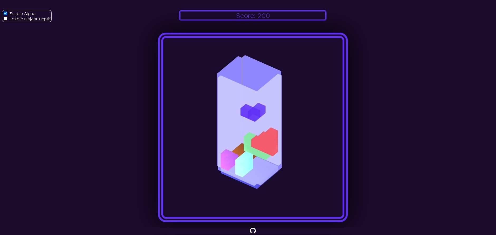
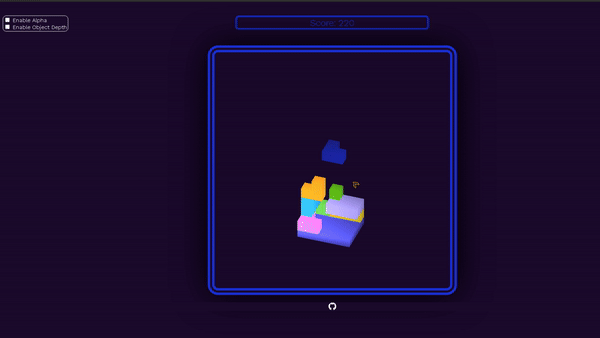

  <h1 align="center">3D Tetris from Scratch Using WebGL</h1>

---

Run index.html in src to play the game

---

## Screenshots

  
  

---

## Gameplay

- **WASD** or **Mouse Drag on Object**: Movement
- **Space**: Fast Drop
- **Q**: Rotate 90 Degrees Around the Y-Axis
- **E**: Rotate 90 Degrees Around the X-Axis
- **Mouse Wheel Scroll**: Zoom In/Out to the Point of Cursor
- **Mouse Wheel Button Drag**: Move Camera Position
- **Arrow Keys** or **Mouse Drag**: Rotate Camera Perspective

---

## Options

- **Height**: Changes ground length on the Z-axis and adjusts invisible walls accordingly
- **Width**: Changes ground length on the X-axis and adjusts invisible walls accordingly
- **Difficulty**: Increases game difficulty by speeding up the falling blocks
- **Enable Alpha**: Enables opacity and displays walls
- **Object Depth**: Enables objects that can grow along the Z-axis

---

## Features

- **Collision Detection**: Prevents rotation or movement if the object would collide after the action
- **Lighting Using Shaders**
- **Fully Configurable Camera Perspective with Mouse**
- **Random Object Generation**
- **Color Transition Based on Main Object's Color**
- **Game Pauses When Window Loses Focus**
- **Direction Fix**: Keeps keyboard inputs accurate by adjusting movement based on camera angles, even after changing the camera perspective
- **Optimized Plane Scanning for Detecting Filled X-Z Planes**
- **Sound Effects**: Triggered by movement, rotation, fast drop, stacking, and plane destruction
- **Responsive Website**
